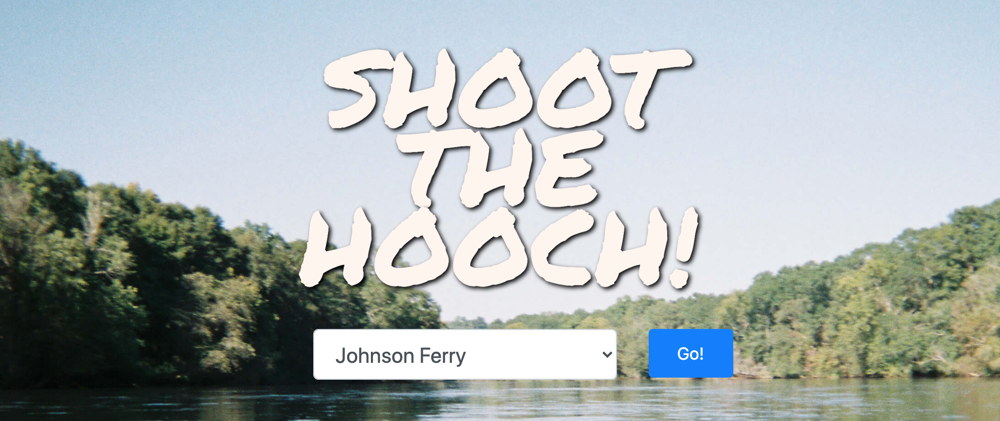

  # Shoot the Hooch!

  

  ## Description
  This site is a place to find information about tubing and rafting conditions on the Chattahoochee river. Once a river location is selected, the current weather and water levels are displayed along with an hourly forecast. The [OpenWeather](https://openweathermap.org/api) API is used to get current and hourly forecasts while the [USGS](https://waterservices.usgs.gov/) provides data on water flow. The USGS API returns water flow values for the past 7 days. A function iterates throught the data to find the current water flow as well as the maximum, minimum, and average water values for the past week. The water level (correlates to water flow) is visualized by means of an html canvas. The max/min values are assigned as the upper/lower limits of the canvas and the current and average values are displayed in between. To create the water animation a variable cycles between 0 and 360 degrees, is converted into radians, and the sin of that number is added to the current water level for each frame of the html canvas. 

  ## Usage
  
  [Shoot the Hooch!](https://shootthehooch.netlify.app/)

  ## Questions
  Github profile: [dgtlctzn](https://github.com/dgtlctzn)
  
  If you have any questions about the project please contact josephperry720@gmail.com
  ## License
  This project is covered under the GNU license
